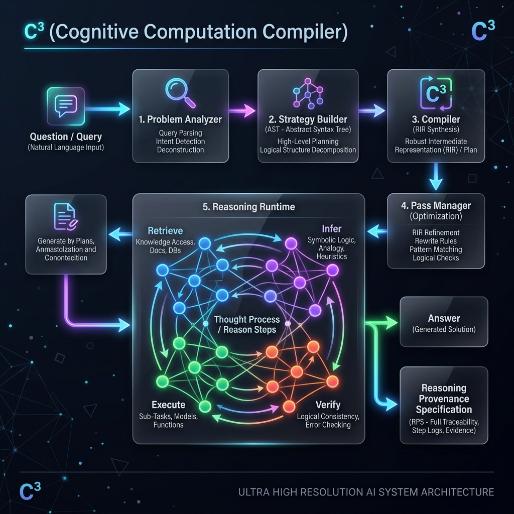

# C³: Cognitive Computation Compiler

<div align="center">
  
</div>

## The Problem: We Are Doing AI Reasoning Wrong

Current AI systems execute essentially one static reasoning pipeline for every problem. Whether you use a prompt-and-generate loop, a Retrieval-Augmented Generation (RAG) system, or a fixed ReAct agent workflow, the structure of the computation remains identical regardless of the task's actual requirements.

A problem requiring complex numerical computation, a problem requiring literary interpretation, and a problem requiring abstract system design all get forced through the exact same computational machinery.

## Our Hypothesis

C³ is built on a single, falsifiable hypothesis:

> **Every problem deserves its own synthesized computation.**

Instead of routing every query through a fixed inference pipeline, C³ acts as a compiler for Large Language Models. It dynamically synthesizes a **Reasoning Intermediate Representation (RIR)** — a typed, directed acyclic graph of reasoning primitives — tailored to the specific problem class.

The goal is to prove that **dynamic reasoning program synthesis** yields better accuracy, lower cost, and stronger verification (higher **Estimated Reasoning Efficiency / ERE**) than static, fixed reasoning pipelines.

## The Architecture

C³ operates on a strict pipeline analogous to LLVM, but designed for natural language reasoning:

1. **Problem Analyzer (Front-End):** Analyzes the natural language query, determining problem class, complexity, and required reasoning profiles.
2. **Strategy Builder:** Emits a declarative `ReasoningStrategy` AST that defines *what* reasoning is needed, without specifying *how*.
3. **Compiler (Middle-End):** Lowers the AST into the **Reasoning Intermediate Representation (RIR)**. This is a strict DAG of primitive opcodes (e.g., `KNOW.RETRIEVE`, `EXEC.PYTHON`, `VERI.VERIFY`, `REAS.INFER`).
4. **Optimizer (Pass Manager):** Fuses redundant steps and prunes dead execution paths before runtime.
5. **Reasoning Runtime (Back-End):** A virtual machine that executes the RIR graph, handling dependencies, timeouts, and register state.
6. **Reasoning Provenance Specification (RPS):** The primary output of the system is the RPS — a complete, auditable trace of the knowledge flow, intermediate states, and calibrated confidence at every node.

## Quick Start (Live API & Web Observatory)

C³ comes with a live Web Observatory UI to visualize the dynamic compilation and execution of reasoning programs in real-time.

```bash
# 1. Install dependencies
pip install fastapi uvicorn httpx pydantic networkx openai

# 2. Set your API keys for live operators
export OPENAI_API_KEY="sk-..."
export TAVILY_API_KEY="tvly-..."
export C3_BACKEND=live

# 3. Start the API server
uvicorn api.server:app --port 8000

# 4. Open the UI in your browser
start ui/index.html
```

## Running the Ablation Study

To test the core hypothesis against strong baselines (Fixed Minimal Pipeline and Fixed ReAct Agent Loop), run the ablation suite over our 40-question diverse benchmark dataset:

```bash
# Run the 4-condition ablation benchmark
python benchmarks/ablation.py
```

*This will output an Estimated Reasoning Efficiency (ERE) matrix and verification rates for C³ vs static pipelines.*

## The Future: Learning Compiler

The complete Reasoning Provenance Specification (RPS) generated from every run serves as training data. The next stage of C³ is the **Learning Compiler**, an LLM-guided planner that uses historical RPS execution logs to empirically improve its own synthesis logic.

---
*For a complete specification of the RIR, Primitive ISA, and Formal Semantics, see [paper/paper.md](paper/paper.md).*
